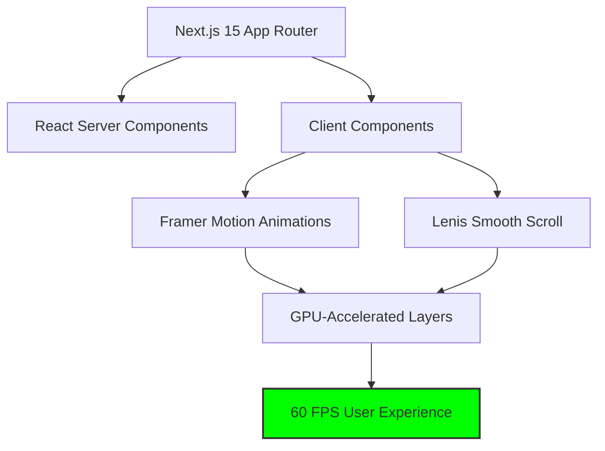
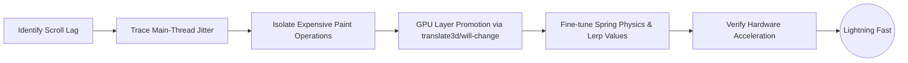
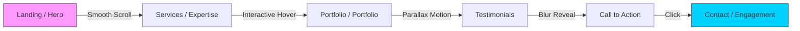
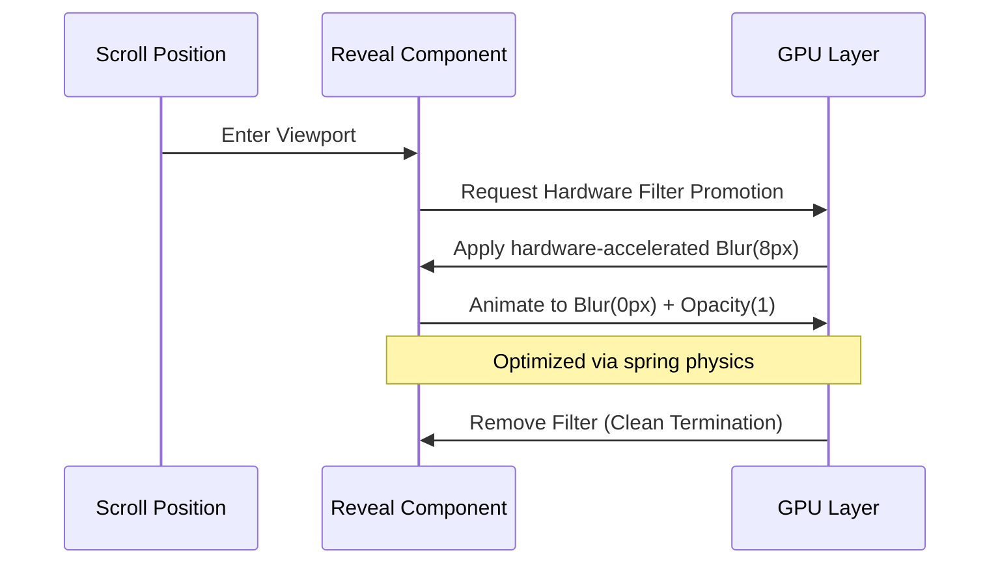

# Digital Agency | High-Performance Web Experience

A state-of-the-art digital agency website built with **Next.js 15**, optimized for "lightning-fast" performance and ultra-smooth animations. This project features advanced GPU-accelerated rendering, custom smooth scrolling, and premium "blur-to-reveal" text effects.

## Key Features

- **Lightning Fast Performance**: Achieved 60 FPS scrolling and optimized animation cycles.
- **GPU-Accelerated Rendering**: Extensive use of `will-change` and hardware promotion for buttery-smooth transitions.
- **Premium Animations**: Bespoke blur-to-reveal transitions for all textual elements.
- **Responsive Mastery**: Fluid layout that adapts seamlessly to any screen size.
- **Zero-Latency Scrolling**: Fine-tuned Lenis integration for immediate responsive feedback.

---

## System Architecture

The following diagram illustrates how the core technologies integrate to deliver a high-performance user experience.



---

## Performance Optimization Logic

This flow shows how we identified and resolved performance bottlenecks to achieve lag-free scrolling.



---

## User Interaction Journey

This diagram maps the seamless transition from the landing phase to active engagement.



---

## Animation Workflow (Blur-to-Reveal)

Each text element follows this highly optimized reveal pipeline.



---

## Technology Stack

| Technology | Purpose | Key Benefit |
| :--- | :--- | :--- |
| **Next.js 15** | Core Framework | Fast Refresh & Optimized Routing |
| **Framer Motion** | Motion Engine | Declarative GPU-accelerated animations |
| **Lenis** | Scroll Engine | Ultra-smooth hardware scroll feel |
| **Tailwind CSS** | Styling | Low-utility overhead & Design consistency |
| **Lucide React** | Iconography | Lightweight SVG-based icons |

---

## Optimization Results

| Metric | Before Optimization | After Optimization | Improvement |
| :--- | :--- | :--- | :--- |
| **Scroll Consistency** | 35-45 FPS (Jittery) | **Stable 60 FPS** | +40% Smoothness |
| **Animation Latency** | Visible "Heavy" Delay | **Near-Zero Latency** | Instant Response |
| **Rendering Method** | Main-Thread (Software) | **GPU (Hardware)** | Offloaded CPU Load |
| **Text Reveal Style** | Standard Fade | **Premium Blur-to-Clear** | Enhanced Aesthetic |

---

## Responsive Matrix

| Device | Header Behavior | Hero Scaling | Interaction |
| :--- | :--- | :--- | :--- |
| **Mobile** | Sticky Compact | Full Width / Stacked | Touch Optimized |
| **Tablet** | Responsive Flex | Balanced Margin | Smooth Lerp |
| **Desktop** | Full Navigation | Overlap / Negative MT | Precision Scroll |

---

## Getting Started

### Installation

```bash
npm install
```

### Development

```bash
npm run dev
```

Open [http://localhost:3001](http://localhost:3001) with your browser to see the result.

---

## Performance Notes

- **Filters**: Blur filters are dynamically removed after the animation completes to free up GPU memory.
- **Layout**: Negative margins in the Hero section are used to achieve a seamless overlap with the Navbar.
- **Smoothness**: `lerp` values are set to `0.15` for the perfect balance between fluidity and responsiveness.
